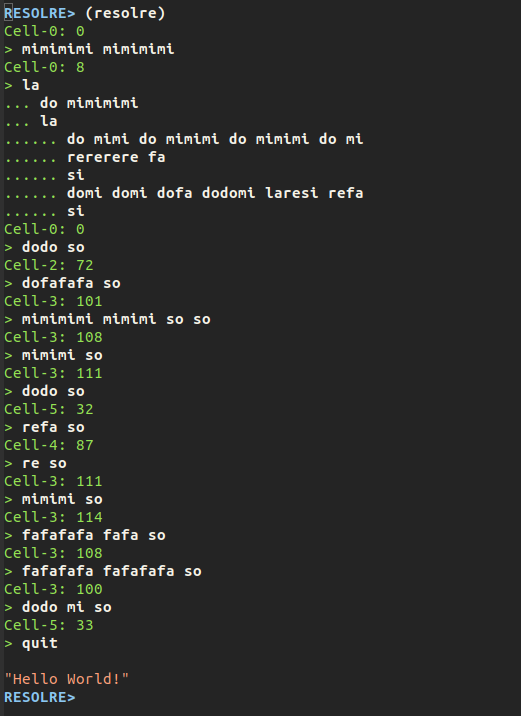

# Resolre
## A Brainfuck Compiler using Solfege syllables

Resolre is a Brainfuck variant adorned with a thin veneer of [Solresol](https://en.wikipedia.org/wiki/Solresol), an invented human language using the syllables of solfege. This implementation includes both a compiler and an interpreter.

Resolre means "Error" in Solresol, in addition to being the inverse of "Solresol" itself. (I also strongly considered Solsolredo, "headache" in Solresol, which honestly bears more resemblance to my experience writing this project).

#### Simple Example (Prints "7")

```
print-7.rsr

mimimimi mimimi      ; c0 = 7
                    
                     ; add 48 to 7 for ascii:
                     
do mimimimi mimimimi ; c1 = 8 (loop counter)
la                   ; start loop
  re mimimimi mimi   ; incr c0 x6
  do fa              ; decr c1
si                   ; end loop

re so                ; print c0 => 55 ("7")
```

### Syntax

Resolre, like brainfuck, is a language that exists within an array of cells, which are navigated, altered, and accessed with only eight commands. Unlike the apocryphal 30k-cell array initialized with the original Brainfuck, Resolre dynamically generates cells as you use them. There are no negative cells, and also no negative values.

Like Solresol, Resolre uses solfege syllables: do re mi fa so la si. Here are the eight Resolre commands, along with their Brainfuck counterparts and their respective functions:

Resolre | Brainfuck | Function
--- | --- | ---
do  | >   | Move one cell to the right
re  | <   | Move one cell to the left
mi  | +   | Increment the current cell
fa  | -   | Decrement the current cell
so  | .   | Print the corresponding ascii character to the value of the current cell
la  | [   | Start loop, if the current cell's value is 0, end loop.
si  | ]   | If cell is non-zero, go back to the start of the loop, else continue past.

### Compiler and Interpreter

Resolre can compile .rsr files from the REPL with `(run-file filepath)`, and can run an interpreter with `(resolre)`, as seen below, with a classic "Hello World!". The interpreter tells you the current cell after your latest command and its value. Unfinished loops carry over onto the next prompt. 



Commands for the interpreter: `quit` or `exit` will, as expected, end your session, `clear` or `new-session` will reset the Resolre environment, and `export` will print out a list of all commands given so far. 

You can also run `make` within the resolre directory to build an executable of the interpreter that you can run with `./resolre` from the command-line. 

### Navigating the Project:

To make things more frustratingly eccentric, and hopefully interesting, I have named the source files according to Solresol translations:

Solresol | Translation
-------- | ----------
laresolre | package
larelasi | list/catalog (the array)
resolremi | commands
solrela-sisolla | lexical-analysis
mirefami | main
solsolredo | brainfuck (conversions)
soldosol | interpreter

### Brainfuck Compatibility

Resolre is nearly Brainfuck compatible, the only difference being that it does not accept char-input.

Therefore, all resolre programs are valid brainfuck programs, and all brainfuck programs that do not take char input are valid resolre programs.

The functions `#'convert-string-to-rsr` and `#'convert-string-to-bf` will convert a string of either language into an equivalent string counterpart, and, likewise, `#'convert-file-to-rsr` and `#'convert-file-to-bf` will convert a file in either language into a corresponding file.

For Example, 

```
(convert-string-to-bf "mimimimi mimimi
                          do mimimimi mimimimi
                          la
                             re mimimimi mimimi
                             do fa
                          si
                          re so")
```

Will Return: 
```
"+++++++>++++++++[<++++++>-]<."
```
And 
```
(convert-string-to-rsr ""+++++++>++++++++[<++++++>-]<.")
```
Returns 
```
"mimimimimimimidomimimimimimimimilaremimimimimimidofasireso"
```

### Examples:

These .rsr files have been tested and are up and running, if you'd like to try them out:

`(run-hello-world)`

`(run-dumb-hello-world)`

`(run-print-7)`

`(run-summoning)`

I'll be adding more examples soon. 

### Resources/citations

I've been putting this implementation together with these as my primary references: 

- https://esolangs.org/wiki/Brainfuck 
- https://en.wikipedia.org/wiki/Brainfuck
- https://www.geocachingtoolbox.com/pages/codeTables/solresolDictionary.pdf
